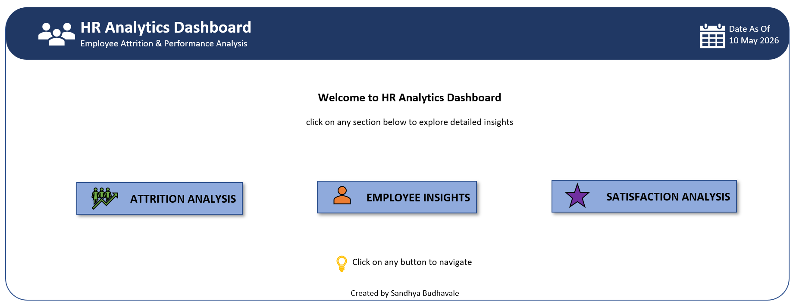
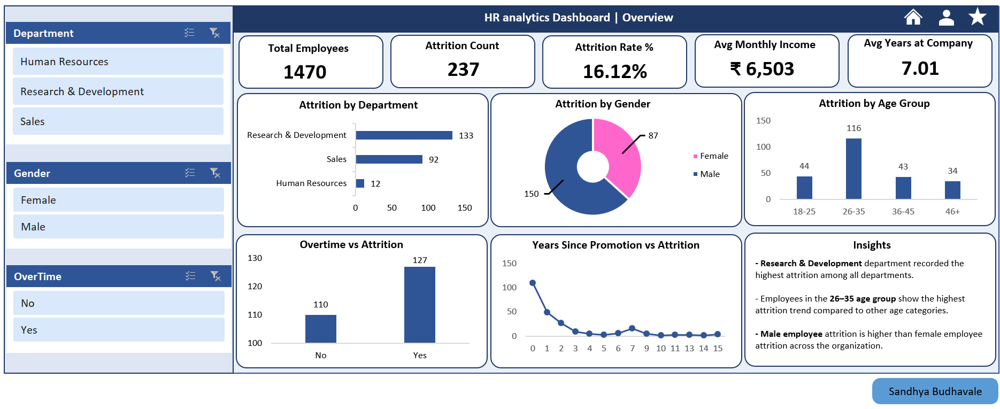
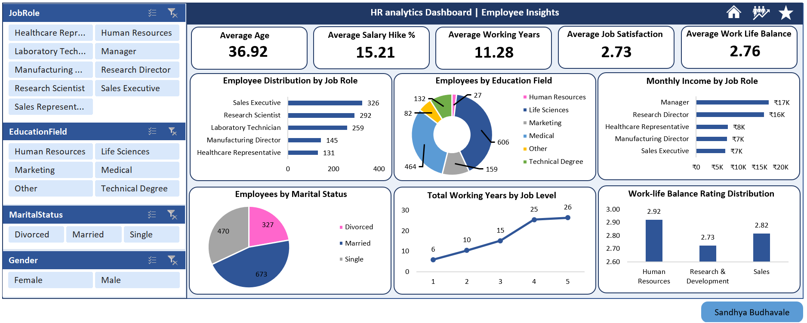
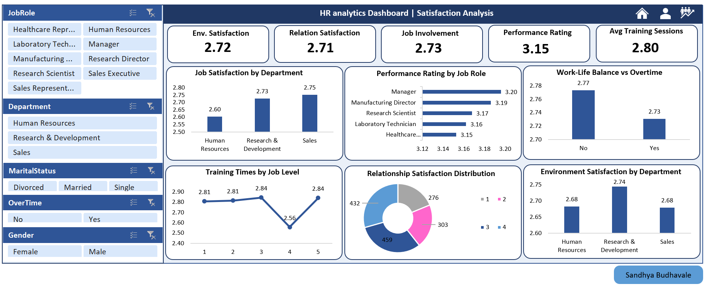

# 📊 HR Analytics Dashboard | Excel Project

An interactive **HR Analytics Dashboard** built in **Microsoft Excel** using Pivot Tables, Pivot Charts, Slicers, Power Query, and KPI Cards to analyze employee attrition, employee insights, and satisfaction trends.

---

# 🚀 Project Overview

This project focuses on analyzing HR data to identify:

- Employee Attrition Trends
- Department-wise Analysis
- Employee Demographics
- Work-Life Balance Insights
- Satisfaction & Performance Metrics
- Income & Experience Analysis

The dashboard is fully interactive with slicers and navigation buttons for better user experience.

---

# 🛠 Tools & Technologies Used

| Tool | Purpose |
|------|----------|
| 📗 Microsoft Excel | Dashboard Development |
| 📊 Pivot Tables | Data Aggregation |
| 📈 Pivot Charts | Data Visualization |
| 🎛 Slicers | Interactive Filtering |
| ⚡ Power Query | Data Cleaning |

---

# 📌 Dashboard Sections

## 1️⃣ Overview Dashboard
- Total Employees
- Attrition Count
- Attrition Rate %
- Avg Monthly Income
- Avg Years at Company
- Attrition by Department, Gender & Age Group

---

## 2️⃣ Employee Insights Dashboard
- Employee Distribution by Job Role
- Employees by Education Field
- Monthly Income by Job Role
- Marital Status Distribution
- Work-Life Balance Analysis
- Total Working Years by Job Level

---

## 3️⃣ Satisfaction Analysis Dashboard
- Job Satisfaction Analysis
- Environment Satisfaction
- Relationship Satisfaction
- Performance Rating Insights
- Training Sessions Analysis

---

# ✨ Key Features

✅ Interactive Slicers  
✅ Dynamic Pivot Charts  
✅ Navigation Buttons  
✅ KPI Cards  
✅ Multi-page Dashboard  
✅ Business Insights Summary  
✅ Responsive Layout Design  

---

# 📸 Dashboard Preview

## 🏠 Home Page

---

## 📊 Attrition Analysis Dashboard

---

## 👥 Employee Insights Dashboard

---

## 😊 Satisfaction Dashboard

---

# 🎥 Dashboard Demo

👉 [Click Here to Watch Demo](Demo/Demo_video.mp4)

---

# 📊 Dataset Used

Dataset: IBM HR Analytics Employee Attrition & Performance Dataset

---

# 💡 Insights Generated

- Research & Development department recorded the highest attrition.
- Employees aged 26–35 showed the highest attrition trend.
- Overtime employees had comparatively higher attrition.
- Higher job levels showed increased total working years.

---

# 👩‍💻 Created By

**Sandhya Budhavale**  

## 📜 License

This project is licensed under the [MIT License](./LICENSE).
